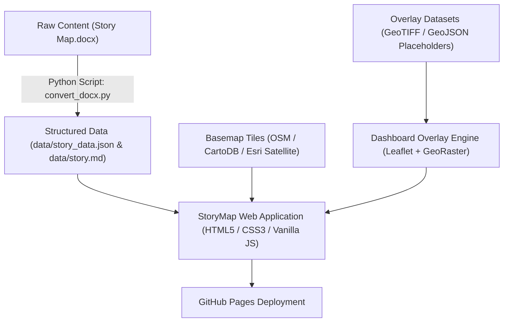

# Beki River StoryMap & Catchment Dashboard — Implementation Plan

## Project Overview
This project builds an interactive, scroll-driven **StoryMap** and **Catchment Dashboard** for the Beki River system (stretching from Kurichhu, Bhutan down to Kalgachia Circle, Assam, India). The application will be hosted as a zero-backend static website on **GitHub Pages**, with an automated **Python data pipeline** for non-expert content management.

---

## Technical Architecture & Technology Stack



### Stack Components:
1. **Frontend**: HTML5, Modern CSS (CSS Grid/Flexbox + Glassmorphism theme), Vanilla JavaScript (ES6 Modules) for lightweight performance without heavy build tool dependencies.
2. **Mapping Engine**: **Leaflet.js** (or MapLibre GL JS) for lightweight, responsive, tile-based mapping with built-in smooth fly-to animations and GeoJSON/Raster support.
3. **Data Pipeline**: Python 3 (using standard library `zipfile` & `xml.etree` / `pandas` / `geopandas`) to transform word documents (`.docx`) into clean, validated JSON & Markdown.
4. **Basemap Providers**:
   - **CartoDB Positron**: Clean minimal map for high contrast with story markers and overlays.
   - **Esri World Imagery**: High-res satellite imagery showing river channels, sediment deposit, and erosion.
   - **OpenTopoMap / OpenStreetMap**: Topographic and general terrain context.
5. **Dashboard Layer Engine**: `georaster-layer-for-leaflet` for client-side geotiff rendering + Leaflet GeoJSON layer controls + Timeline Slider widget.

---

## Implementation Phases

### Phase 1: Data Pipeline & Content Extraction
- [x] Inspect `inputs/Story Map.docx` and extract initial 10 Points of Interest (POIs).
- [ ] Create `scripts/convert_docx.py`:
  - Parses docx content.
  - Converts Lat/Lon coordinates (supporting DMS `27° 12′ 58″ N` and Decimal `26.58° N`).
  - Generates `data/story_data.json` with metadata structure:
    ```json
    {
      "id": 1,
      "title": "Tsatichhu — When the mountain became a dam",
      "lat": 27.51,
      "lon": 91.16,
      "subtext": "Latitude: 27° 30' N | Longitude: 91° 10' E",
      "narrative": "...",
      "media": { "type": "image", "url": "assets/images/poi1.jpg", "caption": "" }
    }
    ```
- [ ] Create `data/story_points.md` as a human-readable, easily editable markdown alternative.

---

### Phase 2: Interactive StoryMap Interface
- [ ] **Dual-Pane Layout**:
  - **Left Scrolling Panel**: Sticky header + continuous scrolling narrative cards with step numbers, titles, coordinates badge, media slot, and body text.
  - **Right Map Panel**: Fullscreen interactive map container.
- [ ] **Scrollytelling Engine**:
  - `IntersectionObserver` API for buttery-smooth triggers as cards enter/leave viewport.
  - Smooth map pan/zoom (`map.flyTo([lat, lon], zoom)`) synced with current active POI.
  - Custom numbered map markers with active pulsing halo effects.
  - Marker click listener that smoothly scrolls narrative panel to matching card.
- [ ] **Visual Basemap Selection Suite**:
  - Toggle UI allowing users to visually switch between CartoDB Positron, Esri Satellite, and OpenStreetMap.

---

### Phase 3: Dashboard & Overlay Layers (Timeline & GeoTIFF support)
- [ ] **Dashboard Overlay Drawer / Panel**:
  - Floating action panel to toggle Catchment Dashboard mode.
  - Layer switches for:
    - **Flood Extent Maps** (Historical years: 2004, 2007, 2014, 2023).
    - **River Channel Migration / Erosion Lines** (GeoJSON).
    - **Land Use & Elevation Raster** (Placeholder GeoTIFFs rendered directly in browser).
- [ ] **Interactive Timeline Slider**:
  - Dual-mode slider filtering flood severity overlays by year.

---

### Phase 4: Non-Expert Onboarding & Documentation
- [ ] Create `DATA_ONBOARDING_GUIDE.md`:
  - Simple 3-step guide:
    1. Update `inputs/Story Map.docx` or `data/story_points.md`.
    2. Add images to `assets/images/`.
    3. Run `python scripts/convert_docx.py`.
- [ ] Prepare GitHub Pages deployment setup (`.github/workflows/deploy.yml` and `index.html` static root).

---

## POI Summary Matrix (Extracted from Input Docx)

| POI # | Name | Lat / Lon | Focus Theme |
|---|---|---|---|
| 1 | **Tsatichhu** | 27.51° N, 91.16° E | Landslide dam formation & breach (2004) |
| 2 | **Kurichhu Hydropower** | 27.2161° N, 91.2050° E | Transboundary hydropower & water release comms |
| 3 | **Mathanguri** | 26.7825° N, 90.9578° E | Bhutan-India border crossing & channel bifurcation |
| 4 | **Hakuwa** | 26.63° N, 90.91° E | Channel shift from Hakuwa to Beki ("mora suti") |
| 5 | **Raghobill** | 26.58° N, 90.97° E | Manas National Park grassland ecology & embankments |
| 6 | **Gobardhana** | 26.58° N, 90.98° E | Embankment protection vs breach vulnerability |
| 7 | **Elengamari Chapori** | 26.63° N, 90.98° E | Floodplain island dynamics, drought & irrigation |
| 8 | **Balabheta** | 26.495° N, 90.934° E | Bank erosion & community adaptation measures |
| 9 | **Suwapur** | 26.3291° N, 91.0103° E | Land loss, social displacement & river dynamics |
| 10 | **Kalgachia Circle** | 26.35° N, 90.89° E | Cumulative downstream impact & unprotected banks |

---

## Next Action Items
1. Generate the structured dataset (`data/story_data.json`) from `inputs/Story Map.docx`.
2. Build prototype `index.html` with Leaflet.js scrollytelling & basemap switcher.
3. Review basemap options with user for visual preference.
